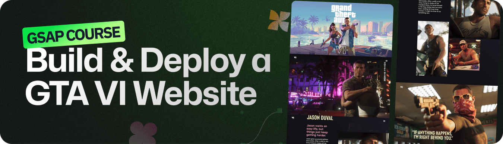

    
   

# GSAP Motion Playground

## 🧠 Description

This project was built as part of my learning process after completing a **GSAP-focused course**.  
To put my knowledge into practice, I recreated a **replica of the GTA VI landing page**, which is known for its strong use of **GSAP-driven animations**.

The goal was to challenge myself by rebuilding complex motion patterns, scroll-based interactions, and timelines, using GSAP as the core animation tool.  
This project served as a **hands-on way to practice, experiment, and solidify my understanding of GSAP** in a real-world-inspired scenario.

---

## 🌐 Live Site

👉 **Live demo:**  
🌐 [Link to Live Demo (Vercel) ↗](https://gtavilanding-juanyut.vercel.app/)

---

## 👨‍💻 Author

**Juan Santillán**
| Front-End Developer and creative enthusiast.

---

## 🛠️ Technologies Used

> The following technologies were used in this project.

  
  
  
  

---

## ✨ Notes

- Project inspired by a GSAP course and real-world animation examples
- Built as a personal challenge to practice advanced motion techniques
- Focused on performance, timing, and scroll-based storytelling
